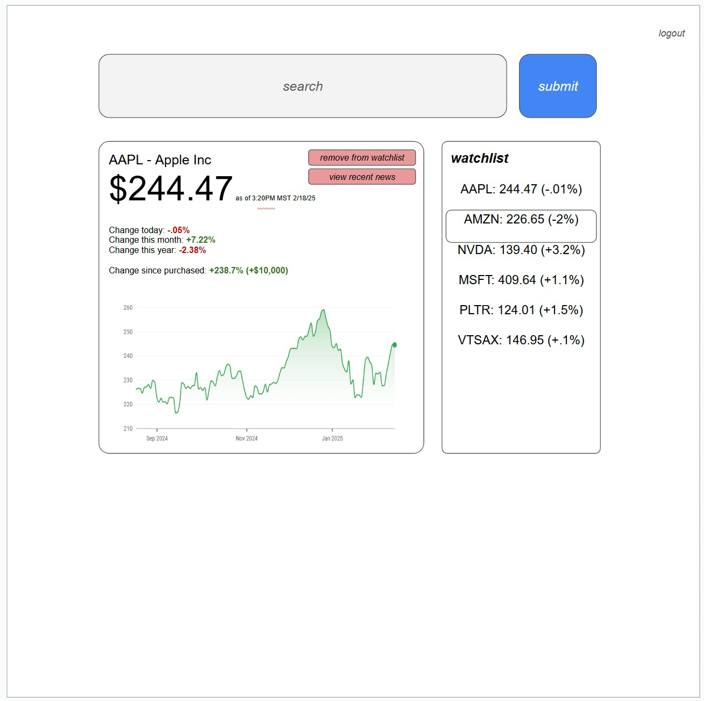
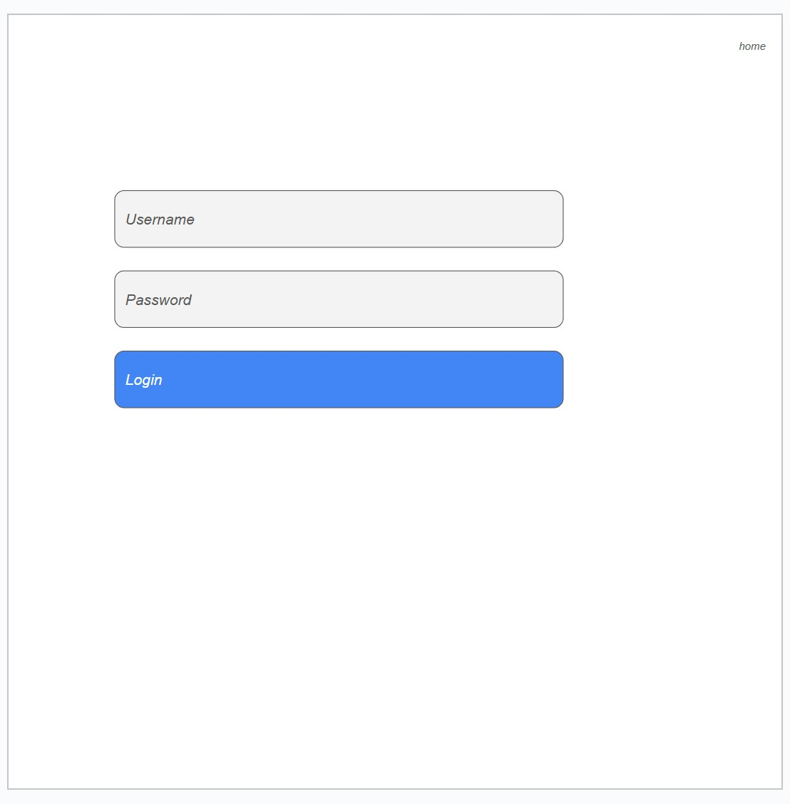
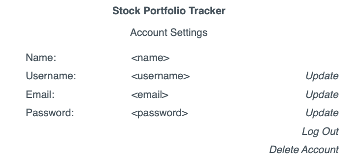
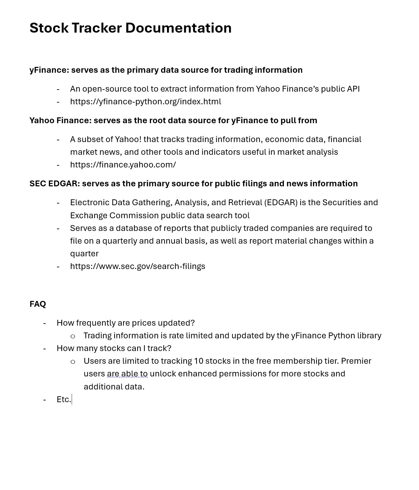
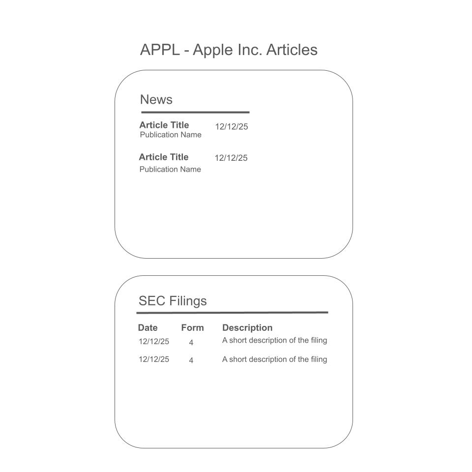

### #1. Homepage (Brendan)

* Page Title: Homepage
* Page Description (include a mockup or hand drawn image of the page): includes the main functionality of the application, allowing users to search for stock information, add that ticker/stock to their watchlist, and remove items from their watchlist. 
* Parameters needed for the page: username, ticker symbol entry
* Data needed to render the page: username, ticker symbol entry
* Link destinations for the page: login (navigates to login page), add to watchlist (appends ticker symbol to user watchlist), watchlist window (users can click ticker symbol to view stock info in main section), view recent news
* List of tests for verifying the rendering of the page: confirm watchlist is loaded properly based on user login, confirm add to watchlist button appends the ticker symbol to the users watchlist, confirm the add to watchlist button changes to remove from watchlist when a ticket symbol is in the users stock list, confirm view recent news button updates with 10 most recent news articles, confirm a valid ticket symbol renders the stock info page properly, confirm an invalid ticker symbol returns an error to the user, confirm validity of response data

### #2. Login (Brendan)

* Page Title: Login
* Page Description (include a mockup or hand drawn image of the page): This page allows users to enter their username and password to login to view their Account Settings and Homepage. It includes two entry forms for users to type their username and password, and a button to login. When the login button is clicked, the username and password are checked against the users table to confirm they are both valid. If they match the username and password stored in the database, the user is admitted. If they do not match, but the username exists, users will be returned to try their password again. If the username does not exist, the user is given the option to create a new account, which appends the username to the table. .
* Parameters needed for the page: username, password
* Data needed to render the page: no external data needed to render
* Link destinations for the page: Homepage (either through the login page, or link in top right corner to return home)
* List of tests for verifying the rendering of the page: test to verify that user inputs are sanitized properly, test to validate incorrect password is denied entry, test to confirm that valid password is granted entry, test to confirm that new accounts are created properly

### #3. Account Settings

* Page Title: Account Settings
* Page Description (include a mockup or hand drawn image of the page): This page contains the account details of the user (name, username, email) as well as account related actions (update username, email, password as well as log out and delete account). .
* Parameters needed for the page: name, username, email, password
* Data needed to render the page: name, username, email, password
* Link destinations for the page: clicking 'Stock Portfolio Tracker' leads to Homepage, clicking 'Logout' or 'Delete Account' leads to Login page
* List of tests for verifying the rendering of the page: correctly display all user information, logging out or deleting account leads to being redirected to the Login page, clicking 'Stock Portfolio Tracker' leads to Homepage and able to update username, email id and password

### #4. Documentation (Brendan)

* Page Title: Documentation
* Page Description (include a mockup or hand drawn image of the page): This page contains documentation details on the external data sources referenced. 
* Parameters needed for the page: this page contains static text fields only
* Data needed to render the page: this page contains status text fields only
* Link destinations for the page: yFinance Python module documentation page, SEC EDGAR documentation page
* List of tests for verifying the rendering of the page: confirm text renders properly and content length is correct, confirm clicking links opens content page in new tab and go to the correct destination

### #5. Stock Articles

* Page Title: Stock Articles
* Page Description (include a mockup or hand drawn image of the page): This page displays recent news articles and SEC filings related to a specific stock.

* Parameters needed for the page: List of news articles including: article title, date, and pulibation source for each article. List of SEC Filings including: filing date, form number, and description for each filing.
* Data needed to render the page: article name, article date, article pulication, filing date, filing form number, filing desciption
* Link destinations for the page: Clicking on a new article box opens the news article in a new tab. Clicking on an SEC filing row opens the filing in a new tab.
* List of tests for verifying the rendering of the page: Correctly display a static list of news articles, verify news article title is a string, verify the date is in the correct format, verify the publication source is a string. Correctly display a static list of SEC filings, verify the date is the correct format, verify the form number matches a known valid option (stored in an enum), verify the description is a string. Verify clicking aricle goes to the correct page. Verify clicking SEC filing goes to the correct page. Add an article with known data to the News section and verify the data matches what is expected. Add an row with known data to the SEC Filing table and verify the data matches what is expected. 
